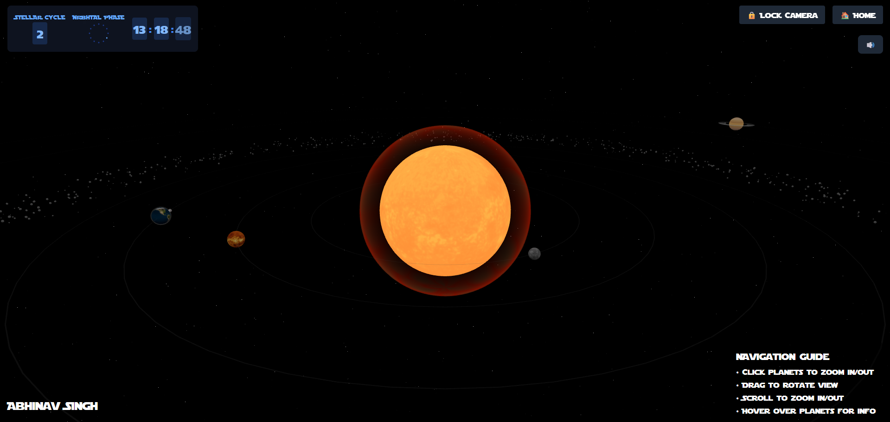

# 🌌 Interactive Space Portfolio

An immersive, interactive 3D portfolio website built with Next.js, Three.js, and React Three Fiber. Navigate through a cosmic environment featuring a detailed solar system where each planet represents different aspects of my professional profile.

## Tech Stack


## Demo Preview


## Features

- **Interactive 3D Space Environment**
  - Fully navigable solar system
  - Custom planet shaders and effects
  - Dynamic lighting and particle systems
  - Realistic planet textures and rotations

- **Immersive User Experience**
  - Smooth camera transitions
  - Interactive planet hovering and clicking
  - Ambient space sounds and music
  - Responsive design with mobile warning

- **Technical Highlights**
  - Error boundary implementation for robust error handling
  - Custom WebGL context handling
  - Optimized 3D model loading and rendering
  - Efficient state management
  - Type-safe development with TypeScript

## Planets & Navigation

Each planet in the solar system represents a different section of the portfolio:

- **Mercury**: Journey and Introduction
- **Venus**: Projects Showcase
- **Earth**: Technical Skills
- **Mars**: Professional Experience
- **Jupiter**: Contact Information
- **Saturn**: Blog and Thoughts

## Technology Stack

- **Frontend Framework**: Next.js 14
- **3D Graphics**: Three.js, React Three Fiber
- **Animation**: Framer Motion, GSAP
- **Styling**: Tailwind CSS
- **Audio**: Howler.js, use-sound
- **Type Safety**: TypeScript
- **Development Tools**: ESLint, PostCSS

## Installation

1. Clone the repository:
   ```bash
   git clone https://github.com/abhinavsingh1311/mixtape-lab.git
   ```

2. Install dependencies:
   ```bash
   npm install
   ```

3. Run the development server:
   ```bash
   npm run dev
   ```

4. Open [http://localhost:3000](http://localhost:3000) in your browser

## Development

### Prerequisites

- Node.js 18.0 or higher
- npm or yarn

### Project Structure

```
src/
├── components/     # React components
│   ├── shared/    # Shared UI components
│   ├── three/     # Three.js components
│   └── ui/        # User interface components
├── pages/         # Next.js pages
│   └── planets/   # Individual planet pages
└── styles/        # Global styles
```

## Controls

- **Camera Movement**: 
  - Free mode: Drag to rotate, scroll to zoom
  - Locked mode: Automatic tracking

- **Planet Interaction**: 
  - Hover for information
  - Click to visit detailed view

- **Navigation**: 
  - Use the top-right menu for camera controls
  - Click home button to return to main view

## Performance Optimizations

- Dynamic imports for large components
- Optimized 3D models and textures
- Efficient particle systems
- Proper garbage collection
- Memory leak prevention

## Responsive Design

While the application is fully responsive, it's optimized for desktop viewing due to the complex 3D interactions. A mobile warning is displayed on smaller screens.

## Contributing

Contributions are welcome! Please feel free to submit a Pull Request.

## License

This project is licensed under the MIT License - see the [LICENSE](LICENSE) file for details.

## Acknowledgments

- Planet textures from [Solar System Scope](https://www.solarsystemscope.com/textures/)
- 3D models and resources from various open-source projects
- Special thanks to the Three.js and React Three Fiber communities

## Contact

For any queries or suggestions, please reach out:

- Email: singhabhinav1311@gmail.com
- LinkedIn: [Abhinav Singh](https://linkedin.com/in/singhabhinav13112002)
- GitHub: [abhinavsingh1311](https://github.com/abhinavsingh1311)
